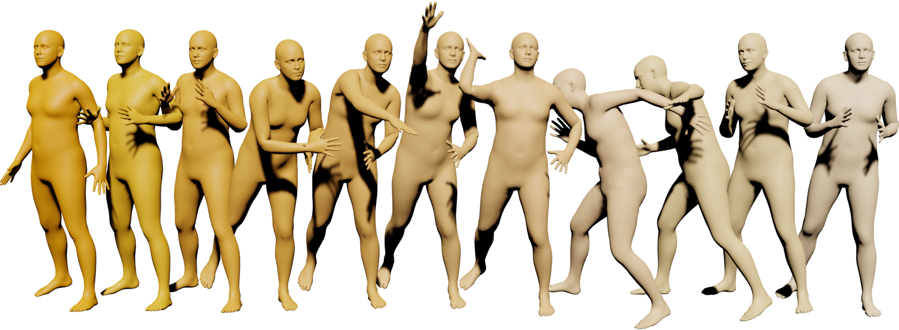
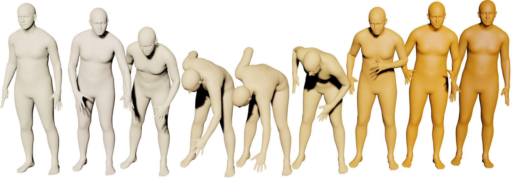

# AMD: Autoregressive Motion Diffusion




<p align="center">
  <a href='https://arxiv.org/abs/2305.09381'>
    
  </a>
  <a href='https://www.youtube.com/watch?v=5A60JwzwWXM'>
  </a>
  </a>
</p>


<p align="center">
<!-- <h1 align="center">InterDiff: Generating 3D Human-Object Interactions with Physics-Informed Diffusion</h1> -->
<strong>AMD: Autoregressive Motion Diffusion</strong></h1>
   <p align="center">
    <a href='' target='_blank'>Bo Han</a>&emsp;
    <a href='' target='_blank'>Hao Peng</a>&emsp;
    <a href='https://www.cs.cityu.edu.hk/~minjdong/' target='_blank'>Minjing Dong</a>&emsp;
    <a href='https://rayeren.github.io/' target='_blank'>Yi Ren</a>&emsp;
    <a href='' target='_blank'>Yixuan Shen</a>&emsp;
    <a href='http://changxu.xyz/' target='_blank'>Chang Xu</a>&emsp;
    <br>
    Zhejiang University &emsp; Unity China &emsp;
    University of Sydney &emsp; National University of Singapore
    <br>
  </p>
</p>


### 📥 [Dataset]
Coming Soon!


## 📜 TODO List

- [ ] Release the HumanLong3D Dataset
- [ ] Release the HumanMusic Dataset
- [ ] Release the main codes for implementation.

## ⚙️ Implementation

Coming soon!

## 🤝 Citation

If you find this repository useful for your work, please consider citing it as follows:

```
@article{Han2024,
  title={AMD: Autoregressive Motion Diffusion},
  author={Bo Han, Hao Peng, Minjing Dong, Yi Ren, Yixuan Shen, Chang Xu},
  journal={AAAI},
  year={2024}
}
```
